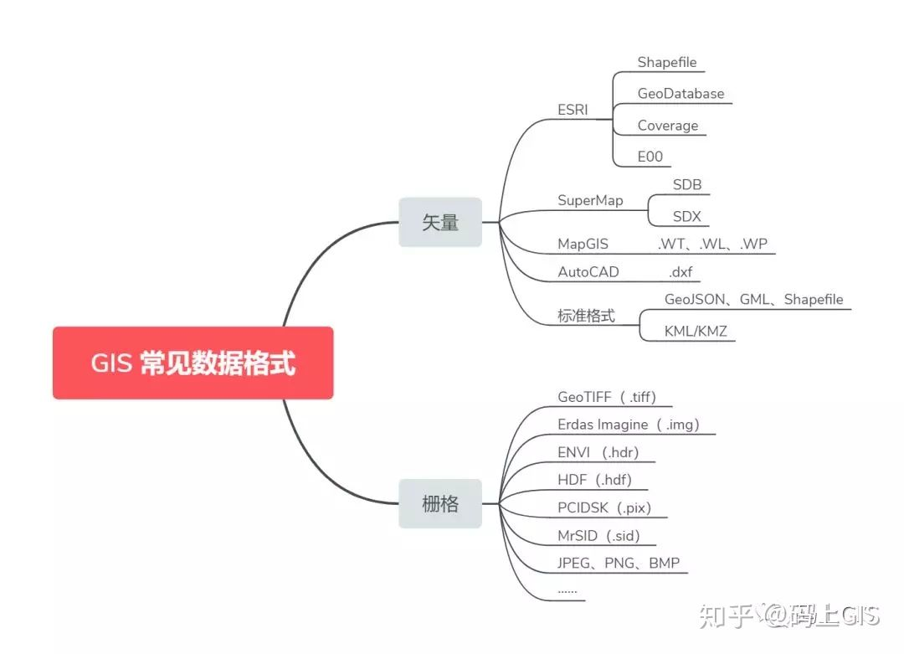
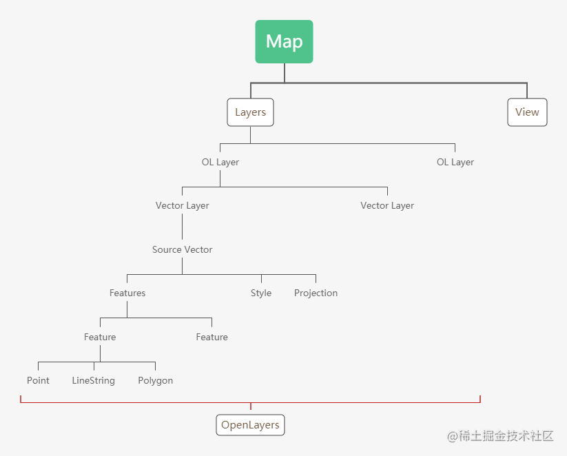

# OpenLayers 使用

[OpenLayers](https://openlayers.org) 开源、比较完备，官网200多个例子，学习曲线比较平缓

## 地图的基本概念

### 不同的坐标系

由于坐标系的不同, 那么就算绘制一个点的坐标也都不会完全相同，所以我们需要告诉解析器要按哪种坐标系进行解析。

在国际上，每个坐标系统都会被分配一个 EPSG 代码（European Petroleum Survey Group 欧洲石油调查组织）

#### 地理坐标系 Geographic coordinate system

**参心坐标系：** 参考椭球的几何中心为原点的大地坐标系

Beijing1954坐标系：克拉索夫斯基椭球体（EPSG:4214）

Xian1980坐标系：IAG75椭球体（EPSG:4610）

**参地坐标系：** 以地球质心为原点建立的空间直角坐标系

WGS84坐标系：全球统一使用，WGS84椭球体（EPSG:4326）

CGCS2000坐标系：CGCS2000椭球体和WGS84椭球极为相似，偏差仅有0.11mm，完全可以兼容使用（EPSG:4510）

#### 投影坐标系 Projected coordinate systems

**椭圆柱投影**

高斯克吕格投影（Gauss Kruger）（EPSG:4510/4528）

横轴墨卡托投影（Universal Transverse Mercator, UTM）（EPSG:3857）

**圆锥投影**

兰伯特投影（Lambert Conformal Conic 正形圆锥）(EPSG:9801/9802/9803/1051)

阿尔伯斯投影（Albers Equal Area Conic 等面积圆锥）（EPSG:102025）

#### 坐标系的选择

研究区域较小时
1. 当使用遥感影像作为主要的数据来源时，可以使用墨卡托投影。
2. 当使用国内地形数据作为主要的数据来源时，可以使用高斯克吕格投影。

研究区范围大，全国及省区制图，跨了好几个3°带甚至6°带，需要使用阿尔伯斯投影或兰伯特投影。

### GIS 地理信息系统

Geographic Information System，用于采集、存储、处理、分析、检索和显示空间数据的计算机系统。

地理空间分析的三大基本要素:

1. 空间位置数据描述地理对象所在的位置，如经纬度坐标
2. 属性数据有是描述特定地理要素特征的定量指标，如公路的等级、宽度、起点、终点等
3. 时域特征数据是记录地理数据采集或地理现象发生的时刻或时段，对环境模拟分析非常重要

地理信息只是一堆数字纪录，需要有合适的软件去把它表示出来。由于将数据的存储与数据的表达进行分离，因此基于相同的基础数据能够产生出各种不同的产品。



[不同地理数据格式的互相转换工具 mapshaper](https://mapshaper.org)

无论是什么数据格式的文件，基本都是在和几何实体（点、线、面）、空间关系、空间索引、空间参考、一般属性这些信息打交道，只是有的格式可能注重于读写效率、有的可能没有保存拓扑关系、有的可能注重数据压缩。

#### 主流的地图绘制模式

地图在放大的时候，区域都是一个方块一个方块的被加载成图像的，打开控制台的network还可以看到有好多png的请求。地图这种超大的数据, 超多细节是如何做到快速渲染的?

##### 栅格瓦片地图

栅格数据就数据结构相对简单，其背后是一门遥感科学与技术（以摄影方式或以非摄影方式获得被探测目标的图像或数据的技术，遥感卫星）

图片像是瓦片一样堆叠起来成为地图，当高度处于不同的数值时采用不同的一套瓦片，世界的瓦片图片 -> 国家 -> 省份 -> 城市 -> 小区，在某个高度范围内是采用放大瓦片图片的方式模拟视野的下降。栅格瓦片以 256 256 或 512 512 大小的图片为介质，这种技术通常是在服务端预先将图片渲染好，前端根据地图的缩放等级，按需加载图片加以拼接。

每次请求瓦片图片都需要传递: 

1. 当前视口所在坐标的经纬度
2. 当前视口宽高 
3. 当前视角高度

缺点：

1. 受到网络带宽开销和存储空间限制的影响大，离线化部署成本高，单套中国主题将近 500G。
2. 样式编辑完后端渲染需要时间长。
3. 无三维的建筑数据，在 3D 场景中无高度信息。
4. 数据保密性差

GeoTIFF 是 GIS 和卫星遥感应用的行业图像标准文件，兼容性好。

Erdas Imagine 遥感图像处理系统，基于瓦片的方式进行数据的存取，这样加快了数据显示和重采样的速度。

HDF（Hierarchical Data Forma）格式是一种不必转换格式就可以在不同平台间传递的数据格式。

##### 矢量地图

矢量数据结构更加复杂，但在 GIS 中使用场景更丰富灵活。

使用 svg，比图片小很多，极少占用服务器空间，降低网络开销，本地化部署中国地图只需5G空间。采用和栅格瓦片相同的分级切割方案，但其瓦片数据传输的是地理数据，包括道路、土地、建筑等，通过在前端做地图的渲染。

shapefile 开放标准格式，不能存储拓扑关系。

File GeoDatabase 采用标准关系数据库技术来表现地理信息的数据模型，在存储能力、平台支持、读写速度、压缩率等方面较强。

GeoJSON 是一种基于JSON的开源标准格式，数据结构简单，可读性强，前后端兼容性好，适合轻量的前端地图展现。

KML 标记语言（Keyhole Markup Language），基于 XML 语法与格式的、用于描述和保存地理信息。

MapGIS 其数据文件主要包括工程文件和工程内各工作区的文件。

## GeoJSON

GeoJSON.IO for VSCode 插件可以在 vscode 中实时查看绘制出的JSON数据。

**数据结构**

```JSON
{
    "type": "FeatureCollection",
    "crs": { // 指明使用的坐标系
        "type": "name",
        "properties": {
            "name": "urn: ogc: def: crs: EPSG: 54031"
        },
    },
    "features": [ // 放置绘制的数据
        {
            "type": "Feature",
            "properties": {}, // 样式属性：边宽，边颜色，填充色，填充透明度
            "geometry": {
                "type": "Point",
                "coordinates": []   
            },
        }
    ]
}
```

**GeoJSON 支持的类型**

```
特征、特征集合："Feature", "FeatureCollection"
特征定义对象的几何形状和属性。
特征集合是特征对象的组合，也是 GeoJSON 的顶级对象。

几何类型：点、线、面、多点、多线、多面
"Point", "LineString", "Polygon", "MultiPoint", "MultiLineString", "MultiPolygon"
长度为2的数组描述一个点，多个长度为2的数组组成的数组描述多个点或者面，多个长度为2的数组组成的数组再组成一个数组描述多条线或者多个面
注意面的坐标首尾要一致，代表相连。
Polygon 类型下一个面里包含了另一个面会做中空处理
MultiPolygon 类型下一个面里包含了另一个面会做重叠处理

几何集合： "GeometryCollection"
可以用数组包含由上面任意的几何形状组成的异构组合，数组的每个元素都是 GeoJSON geometry 对象
```


## openLayers API

map
layer
view
vector
tile
feature



```
> Map ol.map在同一个容器中只可以实例化一个map对象
   >> 一个Map对象中可以有多个底图（OL Layer）
      >>> 我们可以拥有多个矢量图层（Vector Layer）
         >>>> 一个矢量图层对应一个数据图层（Source Vector）
            >>>>> 数据图层图层中对应着一个Feature数组（Features）
               >>>>>> 每个Feature可以拥有点、线、面几种不同的绘制方式还可以设置坐标系、样式等
         >>>> 可以为数据图层做一个全局的Style样式
         >>>> 可以为数据图层设置坐标系
   >> Map只有一个可视区域(View)
```

**支持的 GIS 数据格式**

```
ol/format/GeoJSON 支持读写 GeoJSON 格式的数据
new GeoJSON()
readFeatures(source) 将数据库中保存的 GeoJSON 格式的数据读取为 features
layer.getSource().getFeatures()
writeFeatures(features) 将绘制的 features 转换成 GeoJSON 格式的数据

ol/source/Vector 为 vector layers 提供数据源
new VectorSource({wrapX: false,features: featuresData}) 将读取出来的 features 赋值过来
```

ol/format/TopoJSON
ol/format/EsriJSON
ol/format/KML

**默认使用墨卡托投影 EPSG:3857**

```
ol/proj
transform(coordinate, source, destination) 将坐标值转换
transform(userLocation,'EPSG:4326','EPSG:3857') 将全球统一的WGS84地理坐标系转换成墨卡托投影坐标系
```

**为地图添加一个固定底图层**

内置地图 ol/source/OSM（OpenStreetMap）不能在实际开发中使用

openLayers 允许自定义加载外部在线的地图（例如 mapBox 地图，mapBox Studio 可以自定义样式）

```
ol/Map
ol/layer/MapboxVector
new Map({
    target: 'map', // 挂载地图的 html 元素
    view: new View({center: [0, 0], zoom: 1, projection: 'EPSG:3857'}),
    layers: [  // 第一个 layer 的 visible 永远为 true
        new MapboxVectorLayer({
        styleUrl: 'mapbox://styles/mapbox/bright-v9',
        accessToken: 'your-mapbox-access-token-here'
        })
  ],
});
```

**监听地图上触发的事件**

```
ol/MapEvent
ol/MapBrowserEvent
map.on(eventType, listener)
```

事件类型

```
dblclick singleclick（250ms延迟） movestart moveend loadstart loadend pointerdrag pointermove change error click (dblclick 会触发2次它)
```

事件对象

```
{
    coordinate: Coordinate
    dragging: boolean
    frameState: FrameState
    map: PluggableMap
    originalEvent: Event
    pixel: Pixel
    target: Object
    type: String
}
```

判断是否点击在当前已有的 feature 上

```

```

**为地图添加绘制工具**

```

```


## 其他前端地图可视化框架

[LeafLet](https://leafletjs.com) 开源、体积小、结构清晰、简单易用

[MapBox GL JS](http://www.mapbox.cn) 开源，使用 WebGL，用 C++ 编写的兼容桌面和移动平台的渲染引擎。

[百度地图 JS API](https://lbs.baidu.com/index.php?title=首页) 使用 WebGL，全景图需要付费，QPS 超出需要申请

[高德地图 JS API](https://lbs.amap.com) 

[谷歌地图 JS API](https://developers.google.com/maps) 有更好的国外数据

[eCharts](https://echarts.apache.org/zh/index.html)

[hightCharts](https://www.highcharts.com.cn) 收费